# DAVID-91 XDR

  

  <strong>Digital Advanced Vigilance & Intrusion Defense</strong>

  Plataforma Integrada de Monitoramento, Observabilidade e Cyber Defense

---

# Sobre o Projeto

O **DAVID-91 XDR** é uma plataforma avançada de monitoramento de infraestrutura, observabilidade e defesa cibernética desenvolvida para centralizar múltiplos vetores de vigilância em uma única interface moderna, inteligente e em tempo real.

A plataforma combina:

- Monitoramento de servidores
- Uptime de sites
- SIEM Lite
- Inteligência de vulnerabilidades (CVE)
- Monitoramento de rede
- Observabilidade de bancos de dados
- Controle de usuários e grupos
- Telemetria avançada

Tudo em um único ecossistema.

---

# O Significado do Nome

## DAVID-91

### D.A.V.I.D
**Digital Advanced Vigilance & Intrusion Defense**

O número **91** representa:

- Referência ao **Salmo 91**, conhecido como o salmo da proteção
- 9 vetores de vigilância
- 1 núcleo central de defesa inteligente

---

# Principais Recursos

✅ Dashboard Unificado  
✅ Monitoramento de Sites  
✅ Monitoramento de Servidores  
✅ SIEM Lite  
✅ CVE Intelligence  
✅ Postmortem  
✅ Network Monitoring  
✅ Database Monitoring  
✅ Multiusuário  
✅ Controle por Grupos  
✅ API REST  
✅ JWT Authentication  
✅ Logs Centralizados  
✅ Alertas Inteligentes  
✅ Interface Moderna  
✅ Atualização em Tempo Real  

---

# Interface do Sistema

---

# Dashboard Principal

Visão centralizada de toda a infraestrutura monitorada.

  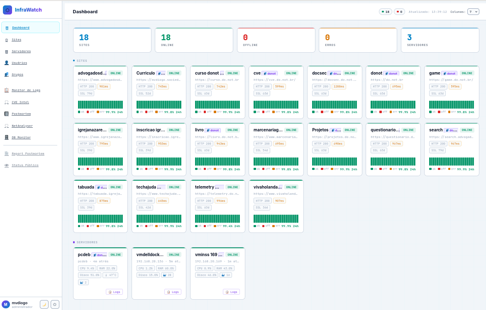

### Recursos do Dashboard

- Visão 360° da infraestrutura
- Atualização automática
- Alertas em tempo real
- Indicadores críticos
- Métricas consolidadas
- Status geral da operação

---

# Monitoramento de Sites

Monitoramento contínuo de websites, APIs e aplicações web.

  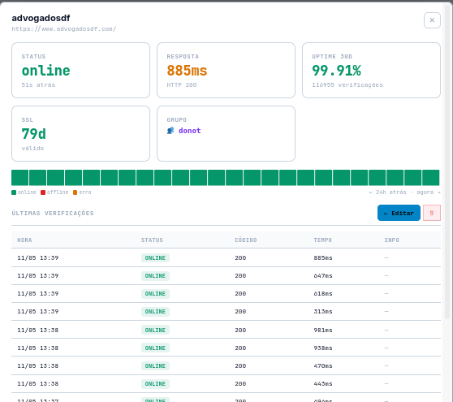

  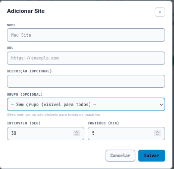

## Funcionalidades

- Uptime monitoring
- SSL validation
- HTTP status validation
- Tempo de resposta
- Histórico de disponibilidade
- Alertas automáticos

---

# InfraWatch — Monitoramento de Servidores

Monitoramento detalhado de servidores Linux, VMs e containers.

  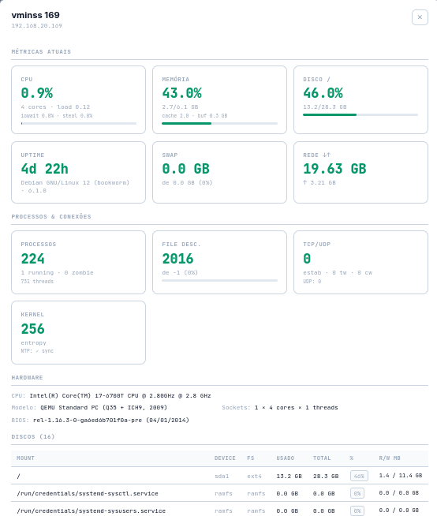

  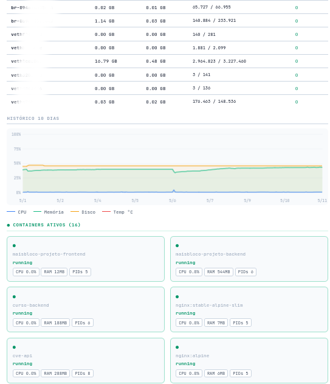

## Métricas Monitoradas

- CPU
- Load Average
- Temperatura
- Memória RAM
- SWAP
- Disco
- I/O
- Rede
- Processos
- Uptime

---

# Detalhamento Avançado

Visualização profunda de hardware, processos e containers.

  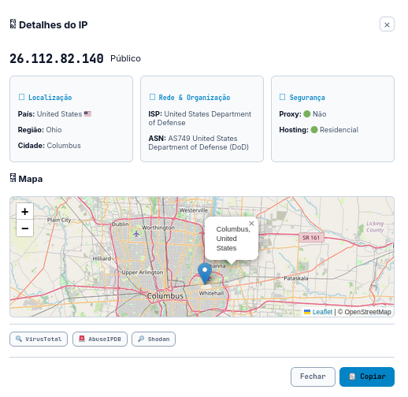

---

# 👥 Gerenciamento de Usuários

Controle completo de autenticação e permissões.

  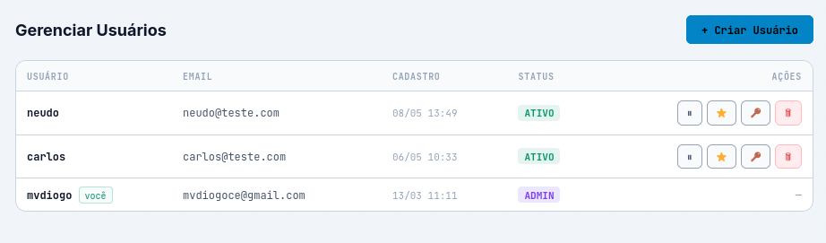

## Recursos

- JWT Authentication
- Senhas com bcrypt
- Controle de acesso
- Auditoria
- Logs de acesso
- Permissões administrativas

---

# Gerenciamento de Grupos

Segmentação inteligente de infraestrutura e usuários.

  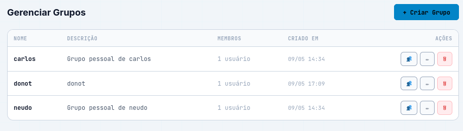

## Benefícios

- Segmentação por equipe
- Ambientes separados
- Controle granular
- Multi-tenant ready
- Organização escalável

---

# LogMonitor — SIEM Lite

Sistema centralizado de ingestão e análise de logs.

  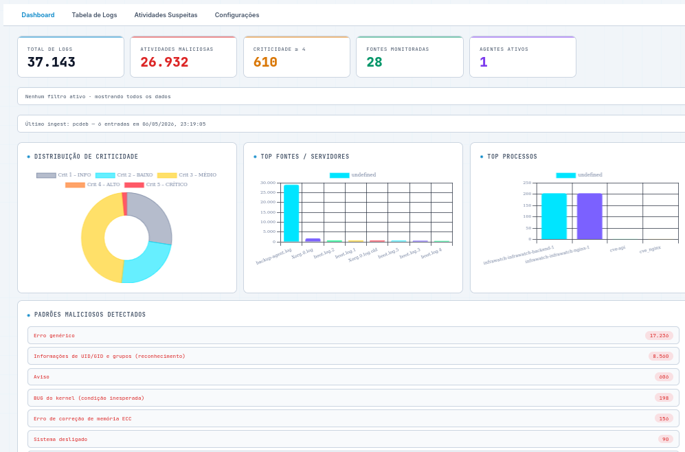

## Capacidades

- Ingestão de logs
- Regex intelligence
- Detecção de ameaças
- Classificação de criticidade
- Correlação de eventos
- Visualização analítica

---

# CVE Intel

Inteligência de vulnerabilidades integrada ao NVD/NIST.

  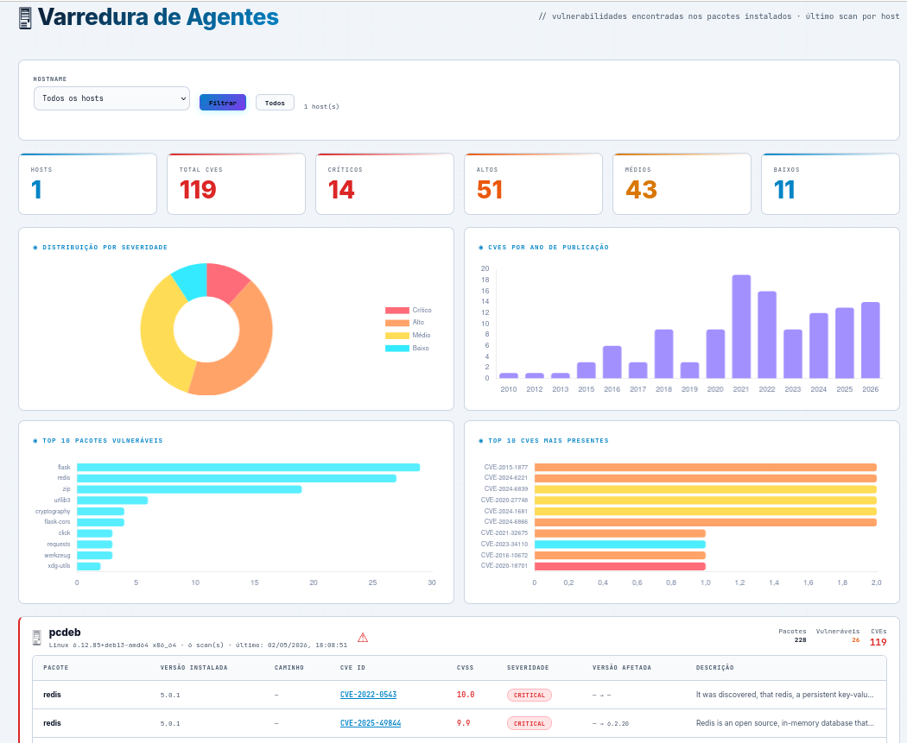

## Recursos

- Integração NVD
- CVSS Scoring
- Busca de CVEs
- Vulnerability Tracking
- Alertas críticos
- Histórico de vulnerabilidades

---

# Postmortem

Gestão de incidentes e análise de causa raiz.

  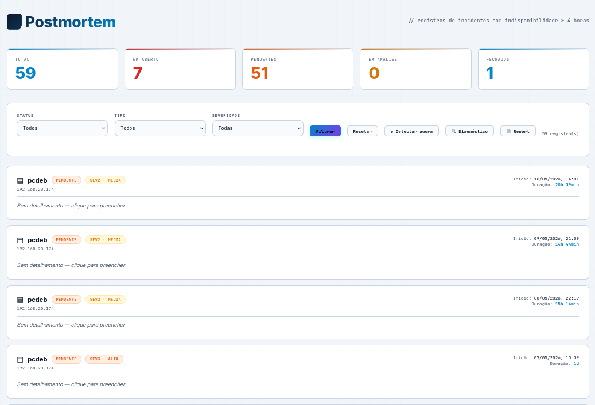

## Recursos

- Timeline de incidentes
- Root Cause Analysis
- Relatórios
- Histórico operacional
- Lições aprendidas
- Auditoria

---

# NetAnalyser

Monitoramento de rede e serviços externos.

  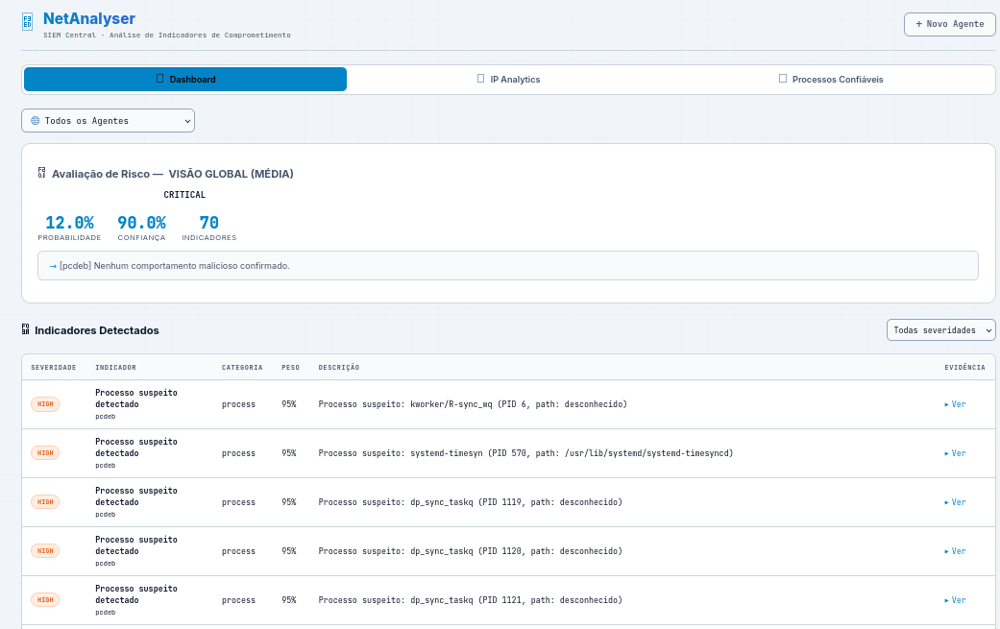

  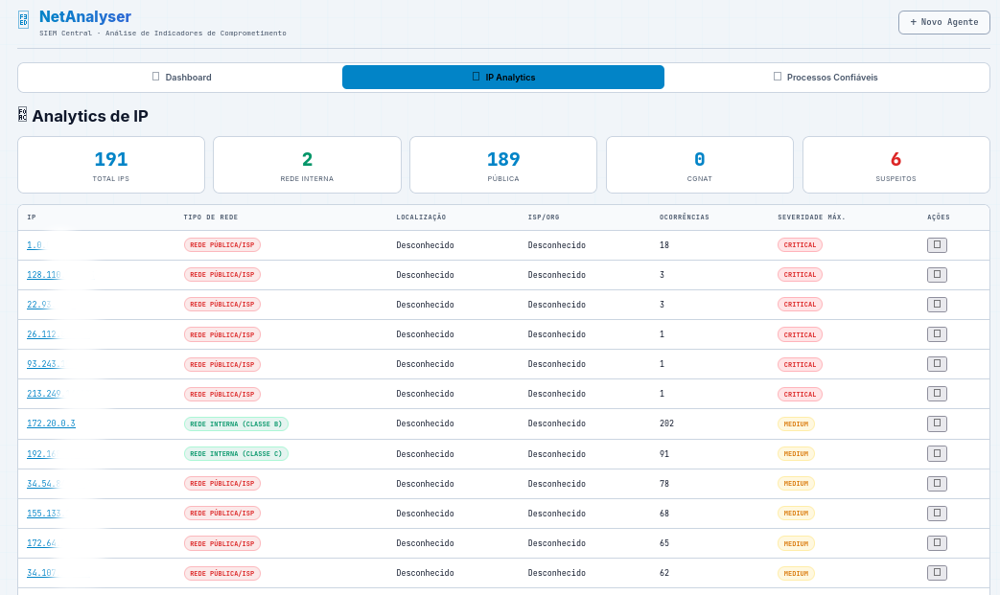

## Funcionalidades

- Ping monitoring
- HTTP check
- SSL validation
- Port monitoring
- DNS validation
- Latência de rede

---

# DBMonitor

Monitoramento avançado de bancos de dados.

  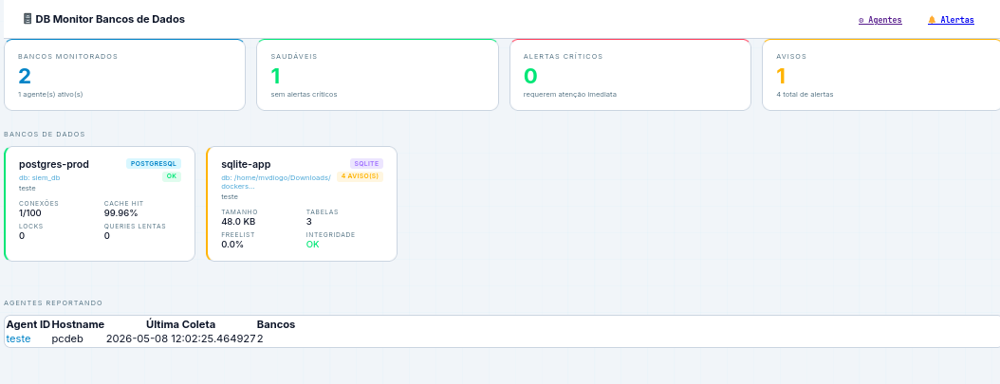

  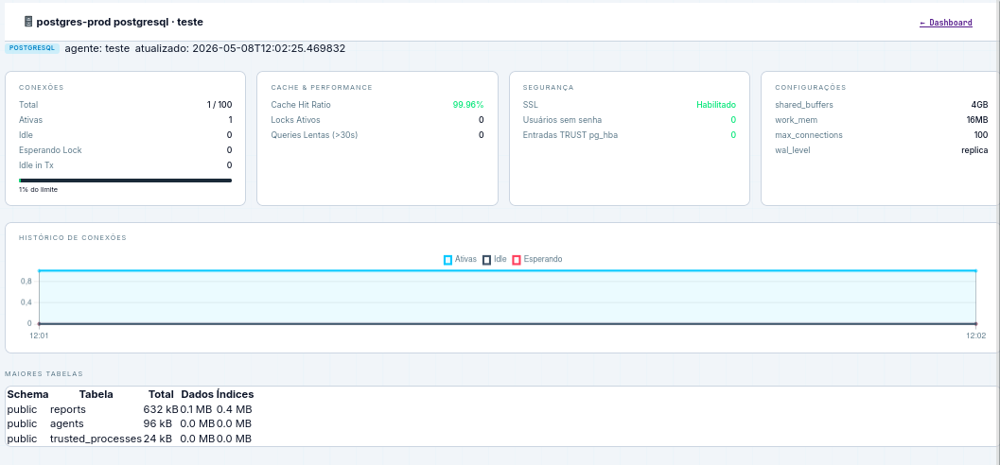

## Bancos Suportados

- PostgreSQL
- SQLite
- MySQL
- Extensível para outros bancos

## Métricas

- Conexões ativas
- Locks
- Transações
- Cache hit ratio
- Replicação
- Índices
- Performance SQL

---

# Roadmap

## Concluído

- Dashboard Unificado
- Multi-Banco
- SIEM Lite
- JWT Authentication
- Monitoramento em Tempo Real

## Em Desenvolvimento

- Alertas Telegram
- Alertas Slack
- Discord Integration
- Agentes distribuídos

## Futuro

- Machine Learning para anomalias
- SOAR
- IA para correlação de eventos
- Threat Intelligence
- Mobile PWA
- Multi-tenant corporativo

---

# Stack Tecnológica

## Backend

- FastAPI
- Python 3.14
- PostgreSQL 16
- SQLAlchemy
- JWT
- Bcrypt

## Frontend

- HTML5
- CSS3
- Vanilla JavaScript
- Glassmorphism UI
- Responsive Design

## Infraestrutura

- Docker
- Docker Compose
- NGINX
- Linux
- Alpine
- OWASP CRS

---

# Segurança

O DAVID-91 XDR foi projetado com foco em segurança desde sua arquitetura.

## Recursos de Segurança

- JWT Authentication
- Bcrypt Password Hashing
- Rate Limiting
- Headers seguros
- TLS/SSL
- Proteção OWASP
- Validação de entrada
- API segura
- Controle granular de permissões

---

# Módulos do Sistema

| Módulo      | Função                           |
| ----------- | -------------------------------- |
| Dashboard   | Visão geral da infraestrutura    |
| InfraWatch  | Monitoramento de servidores      |
| SiteMonitor | Uptime e SSL                     |
| LogMonitor  | SIEM Lite                        |
| CVE Intel   | Inteligência de vulnerabilidades |
| NetAnalyser | Monitoramento de rede            |
| DBMonitor   | Observabilidade de banco         |
| Postmortem  | Gestão de incidentes             |
| IAM         | Usuários e grupos                |

---

# 🌎 Acesso

| Serviço      | URL                                                      |
| ------------ | -------------------------------------------------------- |
| Demo Pública | [https://monitor.do.not.br](https://monitor.do.not.br)   |

---

# Requisitos

* Docker 26+
* Docker Compose
* Linux Server
* 4GB RAM mínimo
* PostgreSQL 16+

---

# API REST

O sistema possui API REST completa para integração externa.

## Recursos disponíveis

* Sites
* Servidores
* Logs
* Usuários
* Grupos
* CVEs
* Alertas
* Métricas
* Incidentes

---

# Observabilidade

O DAVID-91 XDR fornece:

* Métricas em tempo real
* Logs centralizados
* Correlação de eventos
* Inteligência operacional
* Análise de incidentes
* Visibilidade total

---

# Filosofia do Projeto

> “Vigilância Inteligente. Defesa Ativa. Proteção Contínua.”

O DAVID-91 XDR foi criado para fornecer:

* observabilidade,
* resiliência,
* inteligência operacional,
* e proteção contínua para ambientes críticos.

---

# 📞 Contato

## Demonstração

[https://monitor.do.not.br](https://monitor.do.not.br)

## 🏠 Página Oficial

[https://do.not.br](https://do.not.br)

## 💬 WhatsApp

[https://wa.me/556198082524?text=Ol%C3%A1%2C%20gostaria%20de%20conhecer%20o%20DAVID91%20XDR](https://wa.me/5511999999999?text=Ol%C3%A1%2C%20gostaria%20de%20conhecer%20o%20DAVID91%20XDR)

---

# © DAVID-91 XDR

**Digital Advanced Vigilance & Intrusion Defense**

Plataforma de Observabilidade, Monitoramento e Cyber Defense.

